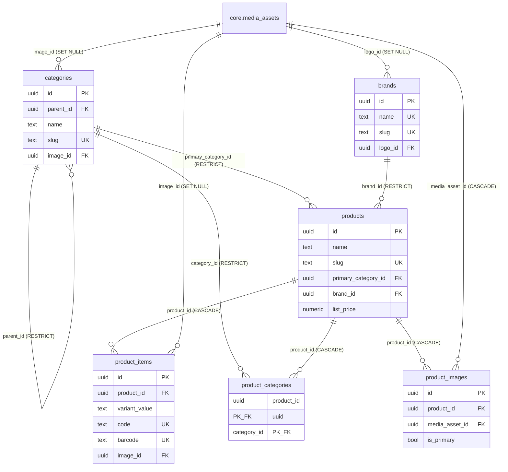

# DATOS — M01 Catálogo de Productos

Diccionario y modelo ER **tal como quedaron construidos** (paso 2 del ciclo, ver `ROADMAP_MODULAR.md`). El diseño de cada campo, su porqué y las reglas de negocio están en `SPEC.md` §6 — este documento no lo repite entero, lo verifica contra la migración y añade lo que solo se ve al implementar: nombres de restricciones tal como quedaron, el comportamiento de cada `ON DELETE`, y los tropiezos de PostgreSQL que el SPEC no podía anticipar.

**Migración fuente:** `Sillar.Modules.Catalog/Migrations/20260816073647_CatalogInitial.cs`.

---

## 1. Historial de esta ficha

**16 de agosto de 2026 (ADR-018).** Al escribir esta ficha, la migración inicial tenía las cuatro columnas hacia `core.media_assets` en `integer`. Correcto según la ADR-016 original, roto según la ADR-017: el catálogo se replica y los medios no se replicaban, así que un producto viajado a otro nodo llegaría con `image_id` apuntando a nada — sin ningún error de clave foránea, porque cada base es coherente por dentro. La ADR-018 corrigió la clasificación: `core.media_assets` también se replica, con `uuid` v7 igual que el catálogo. Las cuatro columnas de abajo ya reflejan esa corrección; no queda ninguna discrepancia entre `SPEC.md` §6 y lo construido.

---

## 2. Diccionario, por tabla

Las cuatro columnas de replicación (ADR-016 regla 4, extendida por la ADR-017 a todo `catalog`) están en todas las tablas y no se repiten en cada una:

| Campo | Tipo | Nulo | Default | Notas |
|---|---|---|---|---|
| `origin_node` | `text` | no | — | Nodo donde nació la fila. Lo fija `CatalogDbContext.StampReplicationColumns`, nunca la base |
| `row_version` | `bigint` | no | `1` | Sube en cada `UPDATE`, la aplicación la incrementa |
| `created_at` | `timestamptz` | no | `now()` | |
| `updated_at` | `timestamptz` | no | `now()` | Trigger `catalog.set_updated_at()` |

### 2.1 `catalog.categories`

| Campo | Tipo | Nulo | Clave / restricción |
|---|---|---|---|
| `id` | `uuid` | no | `pk_categories` — v7, generado en `CatalogEntity.Id` |
| `parent_id` | `uuid` | sí | `fk_categories_parent_id` → `categories.id`, `ON DELETE RESTRICT` |
| `name` | `text COLLATE core.es_search` | no | `ck_categories_name_no_vacio` |
| `slug` | `text COLLATE core.es_ci` | no | `uq_categories_slug`, `ck_categories_slug_formato` |
| `description` | `text` | sí | |
| `image_id` | `uuid` | sí | `fk_categories_image_id` → `core.media_assets.media_asset_id`, `ON DELETE SET NULL` |
| `sort_order` | `integer` | no | `ck_categories_sort_order` (`>= 0`), default `0` |
| `is_active` | `boolean` | no | default `true` |

**Índices:** `idx_categories_parent`, `idx_categories_activas` (parcial, `WHERE is_active`). **Además:** `ck_categories_parent_no_self`.

### 2.2 `catalog.brands`

| Campo | Tipo | Nulo | Clave / restricción |
|---|---|---|---|
| `id` | `uuid` | no | `pk_brands` |
| `name` | `text COLLATE core.es_ci` | no | `uq_brands_name`, `ck_brands_name_no_vacio` |
| `slug` | `text COLLATE core.es_ci` | no | `uq_brands_slug`, `ck_brands_slug_formato` |
| `logo_id` | `uuid` | sí | `fk_brands_logo_id` → `core.media_assets.media_asset_id`, `ON DELETE SET NULL` |
| `is_active` | `boolean` | no | default `true` |

### 2.3 `catalog.products`

| Campo | Tipo | Nulo | Clave / restricción |
|---|---|---|---|
| `id` | `uuid` | no | `pk_products` |
| `name` | `text COLLATE core.es_search` | no | `ck_products_name_no_vacio` |
| `slug` | `text COLLATE core.es_ci` | no | `uq_products_slug`, `ck_products_slug_formato` |
| `short_description` | `text` | sí | |
| `description` | `text` | sí | |
| `primary_category_id` | `uuid` | sí | `fk_products_primary_category_id` → `categories.id`, `ON DELETE RESTRICT` |
| `brand_id` | `uuid` | sí | `fk_products_brand_id` → `brands.id`, `ON DELETE RESTRICT` |
| `list_price` | `numeric(12,2)` | sí | `ck_products_list_price_no_negativo` |
| `sale_unit` | `text` | sí | texto libre |
| `variant_label` | `text` | sí | |
| `is_public` | `boolean` | no | default `true` |
| `is_active` | `boolean` | no | default `true` |

**Índices:** `idx_products_marca`, `idx_products_categoria_principal`, `idx_products_publicos` (parcial, `WHERE is_active AND is_public`), `idx_products_busqueda` (GIN, `to_tsvector('spanish', name || ' ' || coalesce(short_description,''))`).

### 2.4 `catalog.product_items` — la variante

| Campo | Tipo | Nulo | Clave / restricción |
|---|---|---|---|
| `id` | `uuid` | no | `pk_product_items` |
| `product_id` | `uuid` | no | `fk_product_items_product_id` → `products.id`, `ON DELETE CASCADE` |
| `variant_value` | `text COLLATE core.es_search` | sí | `ck_product_items_variant_value_no_vacio`, único con `product_id` (`uq_product_items_valor`, parcial `WHERE variant_value IS NOT NULL`) |
| `code` | `text COLLATE core.es_ci` | sí | `uq_product_items_code` (parcial, `WHERE code IS NOT NULL`), `ck_product_items_code_no_vacio` |
| `barcode` | `text COLLATE core.es_ci` | sí | `uq_product_items_barcode` (parcial), `ck_product_items_barcode_no_vacio` |
| `price_override` | `numeric(12,2)` | sí | `ck_product_items_price_no_negativo` |
| `image_id` | `uuid` | sí | `fk_product_items_image_id` → `core.media_assets.media_asset_id`, `ON DELETE SET NULL` |
| `sort_order` | `integer` | no | `ck_product_items_sort_order` (`>= 0`), default `0` |
| `is_active` | `boolean` | no | default `true` |

**Índices:** `idx_product_items_producto`, `idx_product_items_code_trgm` (GIN trigramas sobre `(code COLLATE "C")`, para buscar por fragmento en caja).

### 2.5 `catalog.product_categories`

Tabla puente, sin `id` propio: dos `uuid` ya son globalmente únicos.

| Campo | Tipo | Nulo | Clave |
|---|---|---|---|
| `product_id` | `uuid` | no | `pk_product_categories` (compuesta), `fk_product_categories_product_id` → `products.id`, `ON DELETE CASCADE` |
| `category_id` | `uuid` | no | `pk_product_categories` (compuesta), `fk_product_categories_category_id` → `categories.id`, `ON DELETE RESTRICT` |

**Índice:** `idx_product_categories_categoria`.

### 2.6 `catalog.product_images`

| Campo | Tipo | Nulo | Clave / restricción |
|---|---|---|---|
| `id` | `uuid` | no | `pk_product_images` |
| `product_id` | `uuid` | no | `fk_product_images_product_id` → `products.id`, `ON DELETE CASCADE` |
| `media_asset_id` | `uuid` | no | `fk_product_images_media_asset_id` → `core.media_assets.media_asset_id`, `ON DELETE CASCADE` |
| `alt_text` | `text` | sí | |
| `sort_order` | `integer` | no | `ck_product_images_sort_order` (`>= 0`), default `0` |
| `is_primary` | `boolean` | no | default `false` |

**Índices:** `uq_product_images_una_principal` (parcial, `WHERE is_primary` — máximo una portada por producto), `uq_product_images_producto_archivo` (único `(product_id, media_asset_id)` — la misma imagen no se asocia dos veces al mismo producto).

**Por qué esta FK es `CASCADE` y las otras tres `SET NULL`.** `product_images` no es más que la asociación: sin archivo la fila no significa nada, así que borrar el archivo borra la asociación. En `categories`, `brands` y `product_items` el archivo es un adorno de una fila que sigue teniendo sentido sin foto: se queda, sin portada.

---

## 3. Modelo ER



**La línea que cruza el schema.** Las cuatro flechas hacia `core.media_assets` son la única salida de `catalog` (SPEC §5): permitidas porque CORE es dependencia **dura**, declaradas en la migración de `catalog` — nunca en la de CORE — y válidas en cualquier nodo porque, desde la ADR-018, las dos tablas están **del mismo lado** de la regla de réplica.

**Lo que este diagrama no muestra: dirección de la dependencia dura declarada en `IModule`.** `CatalogModule.HardDependencies = ["core"]`. Si CORE estuviera inactivo — no ocurre nunca, CORE es la base — el host abortaría el arranque antes de llegar aquí.

---

## 4. Notas de implementación que el SPEC no podía anticipar

**`COLLATE "C"` dentro del propio `CHECK` de formato.** `slug` lleva colación `core.es_ci`, que es no determinista, y PostgreSQL no admite expresiones regulares (`~`) ni `LIKE`/`ILIKE` sobre una colación no determinista:

```
ERROR 0A000: nondeterministic collations are not supported for regular expressions
```

Sin `COLLATE "C"` dentro del `CHECK`, la restricción se crea sin protestar — y **ningún** `INSERT` funciona después, porque el error salta al evaluarla, no al crearla. Es la trampa que motivó la verificación del §5 de este documento: aplicar las migraciones no basta, hace falta un `INSERT` real.

**El mismo problema, mismo remedio, en el índice de trigramas.** `idx_product_items_code_trgm` va sobre `(code COLLATE "C") gin_trgm_ops)`, no sobre `code`. La búsqueda por fragmento en caja tiene que repetir `COLLATE "C"` en la consulta o el índice no se usa.

**Las colaciones se aplican con `ALTER COLUMN ... TYPE` después de crear los índices, no antes.** El proveedor Npgsql, si se le pide la colación en la definición de columna, genera `COLLATE "core.es_ci"` — comillas alrededor del nombre calificado completo, como si fuera un único identificador — y PostgreSQL busca (y no encuentra) una colación llamada literalmente `core.es_ci`. El `ALTER COLUMN` con SQL explícito, ejecutado después de crear los índices únicos, reconstruye esos índices con la colación ya aplicada.

---

## 5. Verificación aplicada (paso 4 del ciclo)

Confirmado el 16 de agosto de 2026 sobre una base recién creada con `docker compose down -v` y las migraciones de CORE y `catalog` aplicadas desde cero — no basta con que la migración se aplique sin error, hace falta un `INSERT` real (§4):

- [x] `INSERT` en `catalog.brands` con un `slug` válido (`artesco`) — pasa.
- [x] `INSERT` con un `slug` inválido (`Faber-Castell`, mayúscula) — falla contra `ck_brands_slug_formato`, con el mensaje del `CHECK` y no un error genérico.
- [x] `\d catalog.brands` muestra `logo_id uuid` con `fk_brands_logo_id → core.media_assets(media_asset_id)`, no solo en el código.
- [x] Una categoría con `image_id` apuntando a una fila real de `core.media_assets`, y al borrar esa fila, `image_id` queda en `NULL` (`ON DELETE SET NULL`) sin que la categoría desaparezca ni falle nada.

Todo ejecutado dentro de una transacción con `ROLLBACK`: la base de datos de desarrollo sigue vacía de datos de negocio (SPEC §6.9).
