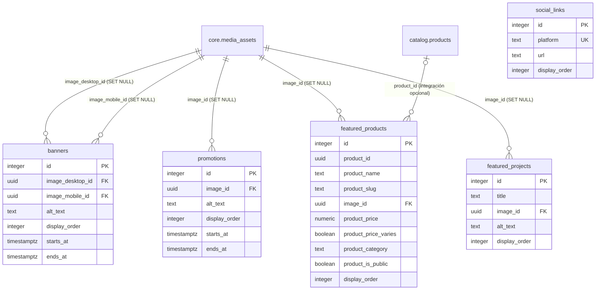

# DATOS — M02 Contenido Web

Diccionario y modelo ER **tal como quedaron construidos** en el paso 2. Las reglas de negocio y el diseño funcional pertenecen a `SPEC.md`; este documento registra el esquema físico, los nombres reales de restricciones y el comportamiento de sus relaciones.

**Migración fuente:** `Sillar.Modules.Cms/Migrations/20260820050000_CmsInitial.cs`.

---

## 1. Historial de esta ficha

**20 de agosto de 2026.** La primera versión reflejaba imágenes obligatorias en banners y trabajos destacados, y `ON DELETE RESTRICT` para esas dos referencias. Antes de construir la API se corrigió la migración inicial: todas las imágenes son opcionales y toda FK hacia `core.media_assets` usa `ON DELETE SET NULL`. No existe una instalación desplegada que requiera conservar el esquema anterior.

---

## 2. Convenciones del schema

Las cinco tablas comparten estas columnas:

| Campo | Tipo | Nulo | Default | Notas |
|---|---|---|---|---|
| `id` | `integer` | no | identidad `GENERATED ALWAYS` | Clave primaria local; M02 solo vive en la WEB y no se replica |
| `is_active` | `boolean` | no | `true` | Baja lógica |
| `created_at` | `timestamptz` | no | `now()` | |
| `updated_at` | `timestamptz` | no | `now()` | Trigger `cms.set_updated_at()` antes de cada `UPDATE` |

Ninguna tabla contiene `origin_node` ni `row_version`: esas columnas pertenecen a datos replicados y el schema `cms` no se replica.

El historial de EF Core vive en `cms.__migrations`, separado del historial de CORE y de los demás módulos.

---

## 3. Diccionario, por tabla

### 3.1 `cms.banners`

| Campo | Tipo | Nulo | Clave / restricción |
|---|---|---|---|
| `id` | `integer` | no | `pk_banners` |
| `title` | `text` | sí | `ck_banners_title_no_vacio` si está presente |
| `subtitle` | `text` | sí | |
| `image_desktop_id` | `uuid` | sí | `fk_banners_image_desktop_id` → `core.media_assets.media_asset_id`, `ON DELETE SET NULL` |
| `image_mobile_id` | `uuid` | sí | `fk_banners_image_mobile_id` → `core.media_assets.media_asset_id`, `ON DELETE SET NULL` |
| `alt_text` | `text` | sí | `ck_banners_alt_text_si_hay_imagen` y `ck_banners_alt_text_no_vacio` |
| `link_url` | `text` | sí | `ck_banners_link_url`: ruta `/...` o URL HTTP(S) |
| `link_label` | `text` | sí | `ck_banners_enlace`: obligatorio y no vacío cuando existe `link_url` |
| `display_order` | `integer` | no | `ck_banners_display_order` (`>= 0`), default `0` |
| `starts_at` | `timestamptz` | sí | `ck_banners_vigencia` |
| `ends_at` | `timestamptz` | sí | posterior a `starts_at` cuando ambas existen |

`ck_banners_alt_text_si_hay_imagen` exige texto alternativo si existe imagen de escritorio o móvil. `ck_banners_alt_text_no_vacio` impide guardar una cadena vacía cuando se proporciona el texto.

**Índice:** `idx_banners_publicados` sobre `(is_active, starts_at, ends_at)`.

### 3.2 `cms.promotions`

| Campo | Tipo | Nulo | Clave / restricción |
|---|---|---|---|
| `id` | `integer` | no | `pk_promotions` |
| `title` | `text` | sí | `ck_promotions_title_no_vacio` si está presente |
| `subtitle` | `text` | sí | |
| `image_id` | `uuid` | sí | `fk_promotions_image_id` → `core.media_assets.media_asset_id`, `ON DELETE SET NULL` |
| `alt_text` | `text` | sí | obligatorio si existe `image_id`; no vacío si está presente |
| `link_url` | `text` | sí | `ck_promotions_link_url`: ruta `/...` o URL HTTP(S) |
| `link_label` | `text` | sí | `ck_promotions_enlace`: obligatorio y no vacío cuando existe `link_url` |
| `display_order` | `integer` | no | `ck_promotions_display_order` (`>= 0`), default `0` |
| `starts_at` | `timestamptz` | sí | `ck_promotions_vigencia` |
| `ends_at` | `timestamptz` | sí | posterior a `starts_at` cuando ambas existen |
| `description` | `text` | sí | |
| `badge_text` | `text` | sí | `ck_promotions_badge_text`: no vacío, máximo 20 caracteres |

### 3.3 `cms.featured_products`

| Campo | Tipo | Nulo | Clave / restricción |
|---|---|---|---|
| `id` | `integer` | no | `pk_featured_products` |
| `product_id` | `uuid` | sí | Sin FK en la migración base; la integración blanda puede añadirla |
| `product_name` | `text` | no | Snapshot; `ck_featured_products_product_name_no_vacio` |
| `product_slug` | `text` | sí | Snapshot; `ck_featured_products_product_slug_no_vacio` si está presente |
| `image_id` | `uuid` | sí | Snapshot; `fk_featured_products_image_id` → `core.media_assets.media_asset_id`, `ON DELETE SET NULL` |
| `product_price` | `numeric(10,2)` | sí | Snapshot; `NULL` = a consultar, `0` = gratis, valor positivo = importe; `ck_featured_products_product_price` |
| `product_price_varies` | `boolean` | no | Snapshot; indica que las presentaciones tienen precios distintos |
| `product_category` | `text` | sí | Categoría efectiva; `NULL` cuando el producto no tiene ninguna; no vacía si está presente |
| `product_is_public` | `boolean` | no | Snapshot del estado público de M01; falso impide publicar el destacado |
| `display_order` | `integer` | no | `ck_featured_products_display_order` (`>= 0`), default `0` |
| `starts_at` | `timestamptz` | sí | `ck_featured_products_vigencia` |
| `ends_at` | `timestamptz` | sí | posterior a `starts_at` cuando ambas existen |

`product_name`, `product_slug`, `image_id`, precio, categoría y estado público forman el snapshot editorial. El producto puede quedar sin enlace vivo y conservar esos datos.

**Integración opcional:** `database/integrations/cms_catalog.sql` añade `fk_featured_products_product_id` → `catalog.products.id` con `ON DELETE SET NULL` cuando ambos módulos están instalados. La migración inicial de CMS no contiene esa FK.

### 3.4 `cms.featured_projects`

| Campo | Tipo | Nulo | Clave / restricción |
|---|---|---|---|
| `id` | `integer` | no | `pk_featured_projects` |
| `title` | `text` | no | `ck_featured_projects_title_no_vacio` |
| `description` | `text` | sí | |
| `image_id` | `uuid` | sí | `fk_featured_projects_image_id` → `core.media_assets.media_asset_id`, `ON DELETE SET NULL` |
| `alt_text` | `text` | sí | obligatorio si existe `image_id`; no vacío si está presente |
| `display_order` | `integer` | no | `ck_featured_projects_display_order` (`>= 0`), default `0` |

### 3.5 `cms.social_links`

| Campo | Tipo | Nulo | Clave / restricción |
|---|---|---|---|
| `id` | `integer` | no | `pk_social_links` |
| `platform` | `text COLLATE core.es_ci` | no | `ck_social_links_plataforma`; `uq_social_links_plataforma` |
| `url` | `text` | no | `ck_social_links_url`: URL HTTP(S) sin espacios |
| `display_order` | `integer` | no | `ck_social_links_display_order` (`>= 0`), default `0` |

Las plataformas admitidas son `facebook`, `instagram`, `tiktok`, `whatsapp` y `youtube`. La colación `core.es_ci` hace que la unicidad ignore mayúsculas.

---

## 4. Modelo ER

**Líneas que cruzan schemas.** Las cinco FK hacia `core.media_assets` pertenecen a la migración de CMS porque CORE es dependencia dura. La línea hacia `catalog.products` no pertenece al esquema base: Catálogo es dependencia blanda y la relación física vive exclusivamente en los scripts de integración.

**Dirección del borrado de medios.** Una fila editorial sigue teniendo sentido sin imagen. Por eso todas las FK de medios anulan la columna y nunca impiden que CORE elimine el archivo.

---

## 5. Objetos auxiliares

- `cms.set_updated_at()`: función de trigger que asigna `now()` a `updated_at`.
- `trg_<tabla>_set_updated_at`: un trigger por cada una de las cinco tablas.
- `cms.__migrations`: historial privado de migraciones de M02.
- `database/modules/cms/02_seed.sql`: seed deliberadamente vacío e idempotente; CMS no instala contenido del negocio.
- `database/modules/cms/99_drop.sql`: elimina únicamente el schema `cms` con sus objetos.
- `database/integrations/cms_catalog_drop.sql`: anula `product_id` antes de retirar la FK opcional, preservando el snapshot.
